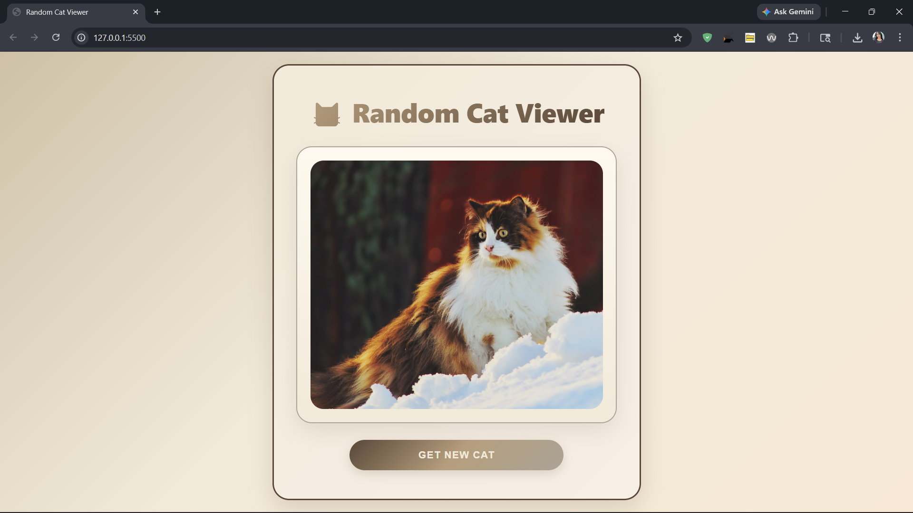

# 🐱 Random Cat Viewer

A simple and fun web app that fetches random cat images using the FreeAPI Random Cat API.

## 🚀 Live Demo
[Live Link](https://random-cat-viewer-delta.vercel.app)

---

## 📸 Screenshot



---

## ✨ Features
- Fetch random cat images dynamically
- Responsive and clean UI
- One-click new cat generator
- Simple HTML, CSS, and JavaScript project

---

## 🛠️ Tech Stack
- HTML
- CSS
- JavaScript
- FreeAPI

---

## 🔗 API Endpoint
```js
 https://api.freeapi.app/api/v1/public/cats/cat/random
```

---

## 📂 Project Setup

1. Clone the repository
```bash
git clone https://github.com/rathitanishka-tech/Random-Cat-Viewer.git
```

2. Open the folder

3. Run `index.html` using Live Server

---

## ❤️ Acknowledgements
Thanks to FreeAPI for providing the API.